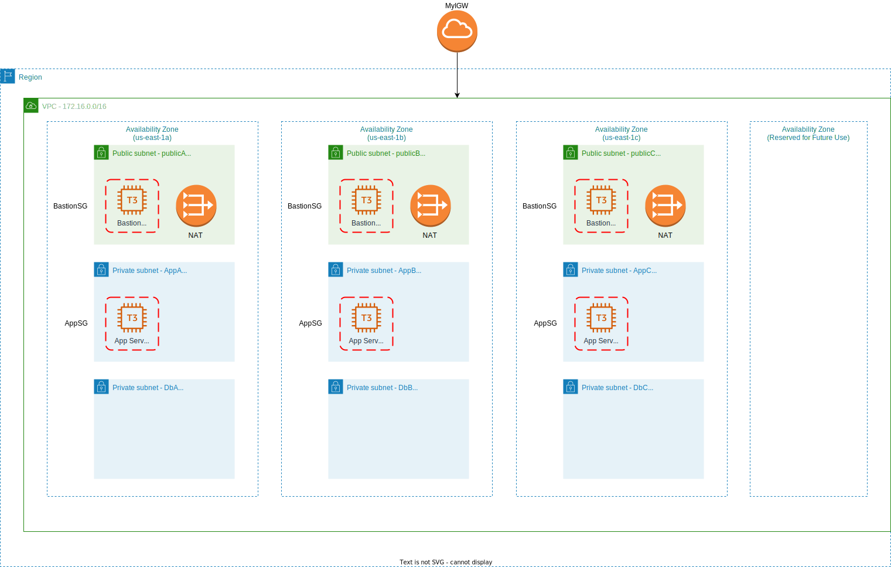
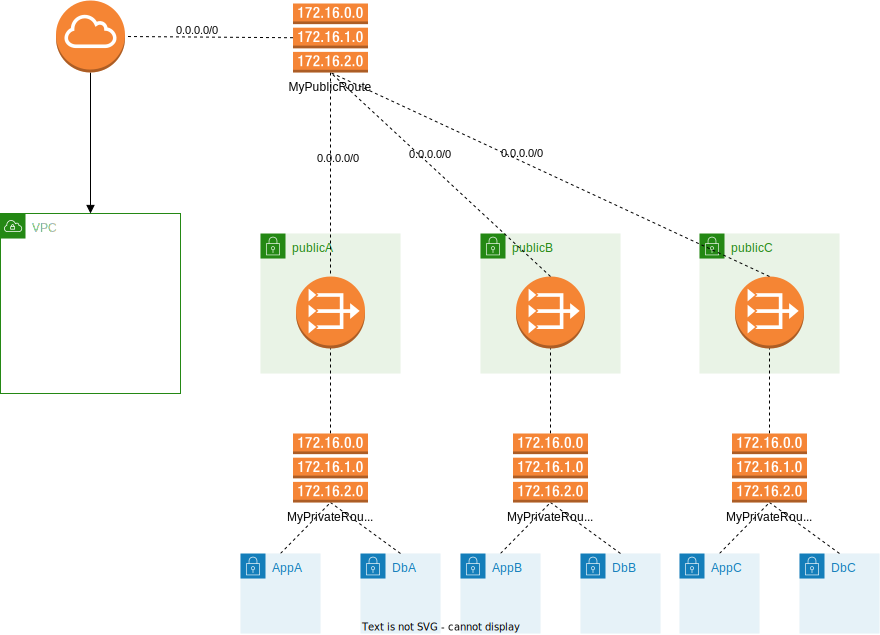

# Koffee Luv Network Layout 

## About

This is my solution to the milestone _"Build a Network Layout from Scratch"_ from the live project 
[Automating Infrastructure for an E-commerce Website with Terraform and AWS](https://www.manning.com/liveprojectseries/automating-infrastructure-with-terraform) 
by Manning.

### The milestone

The objective of this milestone is to use Terraform to describe the AWS infrastructure depicted in 
the following graphic:



This comes down to setting up a network layout (including VPC, internet and NAT gateway, routing tables and security groups) 
in the `us-east` region for a three-tier architecture including app servers which are 
reachable via bastion servers. The whole tier has to be replicated to three availability zones.

### Routing

Part of the milestone is to properly configure the network:
* attach an internet gateway to the VPC
* configure security groups `BastionSG` and `AppSG` for allowed traffic
  to and from the bastion hosts and app servers, respectively
* adding a NAT gateways

The following graphic gives an overview over the routing within the network:



**MyPublicRoute**

| Destination | Target |
|-------------|--------|
| 0.0.0.0/0   | MyIGW  |


**MyPrivateRouteA, MyPrivateRouteB and MyPrivateRouteC**

| Destination | Target |
|-------------|--------|
| 0.0.0.0/0   | NatGW  |

## Project structure

This solution provides a root module and uses child modules: one for setting up
an EC2 instance and another one for setting up the network layout using a 
customizable child module for the creation of a basic network tier: 

```
.
├── img                               # Images for the README
├── modules                           # Modules for this milestone
│   └── three_tier_architecture       # Module for the layout
│       ├── ec2                       # Custom module for setting up a EC2 instance
│       │   ├── main.tf
│       │   ├── output.tf
│       │   └── variables.tf
│       ├── networking                      
│       │   ├── tier                  # Custom module for a single network tier
│       │   │   ├── eip.tf
│       │   │   ├── main.tf
│       │   │   ├── nat_gw.tf
│       │   │   ├── outputs.tf
│       │   │   ├── routes.tf
│       │   │   └── variables.tf
│       │   ├── main.tf
│       │   ├── outputs.tf
│       │   ├── sg.tf                  # Security groups for the network
│       │   └── variables.tf
│       ├── main.tf
│       ├── outputs.tf
│       └── variables.tf
├── Makefile                                      
├── README.md
├── main.tf
├── outputs.tf
├── providers.tf
├── terraform.tfvars                   # You must create your version of this file
├── variables.tf                      
└── versions.tf                        # Version locking
```

## Prerequisites

* AWS account with IAM user `deployer` with the managed policies `AmazonEC2FullAccess` and `AmazonVPCFullAccess` 
  attached. Use `aws configure --profile deployer` to configure a profile for the region `us-east-1`
* Terraform 1.1.8
* Your own SSH keypair which can be used to connect to the EC2 instances, see [Setting up your SSH keypair](#setting-up-your-ssh-keypair)
* Your version of `terraform.tfvars`, see [Setting up your Terraform variables](#setting-up-your-terraform-variables)

### Setting up your SSH keypair

You need an SSH keypair that will be used by the module as the EC2 keypair
which can be used to securely connect to the launched instances. Create this
pair as follows:
```bash
cd $HOME/.ssh
ssh-keygen -q -f ./deployer -C "Key for deploying EC2 instances"
```
To use agent forwarding later you should also add
this key to the SSH agent:
```
ssh-add --apple-use-keychain $HOME/.ssh/deployer
```
Verify that the key has been successfully added to the SSH 
agent using `ssh-add -L`.

### Setting up your Terraform variables

Create a file `$PROJECT_DIR/terraform.tfvars` with the following content:

```bash
region = "us-east-1"
ssh_deployer_key_file = "/path/to/your/home/.ssh/deployer.pub"
```

## How to use

Check out the repository to a location of your choosing. In the following the
environment variable `PROJECT_DIR` is supposed to give the path to this location.

```bash
git clone https://github.com/daniel-pape/koffee-luv-network-layout.git $PROJECT_DIR
cd $PROJECT_DIR
terraform init
AWS_PROFILE=deployer terraform plan -out "network_layout.tfplan"
AWS_PROFILE=deployer terraform apply "network_layout.tfplan"
```
In addition, you can also use the Makefile:

```
make help
make init
make plan
make apply
```

⚠️ **Note:** Always use `AWS_PROFILE=deployer terraform destroy` or `make destroy`
to tear down again all AWS resources after you finished checking out the project.

The remainder of this section outlines how you can connect from the bastion hosts 
to the app server running in the same subnet.

### How to connect to a bastion host

The elastic IP addresses attached to the bastion hosts are
output values of the root module:
* `bastion_a_eips` is the address of the host for AZ `us-east-1a` 
* `bastion_b_eips` is the address of the host for AZ `us-east-1b` 
* `bastion_c_eips` is the address of the host for AZ `us-east-1c` 

To connect to the host in `us-east-1a` you can use the following command based on these output value:
```
ssh -A ec2-user@$(terraform output -state="./terraform.tfstate" -raw bastion_a_eips)
```

### Test connection from the Bastion host to app server

To connect to one of the app servers you can connect
first to the bastion host in the same subnet and subsequently
use SSH to connect from there to the actual app server. 

This is possible on one hand since the security group `BastitionSG` is configured
correspondingly: it allows inbound SSH traffic within the subnet and
all outbound traffic. On the other hand, we need to use the `-A` option for agent forwarding
when connecting to the bastion host.
```bash
ssh -A ec2-user@$(terraform output -state="./terraform.tfstate" -raw bastion_a_eips)
ssh ec2-user@<PRIVATE IP ADDRESS OF APP SERVER>
```
The private IP address of the app server in `us-east-1a` is for example
available as output value via 
```bash
terraform output -state="./terraform.tfstate" -raw app_a_private_ip
```
If you do not use the `-A` option you run into an error when attempting
to connect to the app server using its private IP address.

### Test connection from to app server to the internet 

Once you have jumped from the bastion host to the app server
run:

```
ping 1.1.1.1
```

## References

* [AWS documentation: NAT Gateway Scenarios](https://docs.aws.amazon.com/vpc/latest/userguide/nat-gateway-scenarios.html#public-nat-internet-access).
* [Howtogeek: What is SSH agent forwarding and how do use it](https://www.howtogeek.com/devops/what-is-ssh-agent-forwarding-and-how-do-you-use-it/)
* [Medium: Handing bastion hosts on AWS via SSH agent forwarding](https://crishantha.medium.com/handing-bastion-hosts-on-aws-via-ssh-agent-forwarding-f1d2d4e8622a)
* [Medium: Setting up an SSH agent to access the bastion in VPC](https://medium.com/devops-dudes/setting-up-an-ssh-agent-to-access-the-bastion-in-vpc-532918577949)
* [Medium: Setting up an AWS EC2 instance with SSH access using Terraform](https://medium.com/@hmalgewatta/setting-up-an-aws-ec2-instance-with-ssh-access-using-terraform-c336c812322f)
* [DZone: AWS Elastic Compute Cloud (EC2) Basics](https://dzone.com/articles/aws-elastic-compute-cloud-ec2-basics)
* [DZone: AWS Basics: Bastion Hosts and NAT](https://dzone.com/articles/aws-basics-bastian-hosts-and-nat)
* [AWS documentation: Troubleshoot NAT gateways](https://docs.aws.amazon.com/vpc/latest/userguide/nat-gateway-troubleshooting.html#nat-gateway-troubleshooting-no-internet-connection)